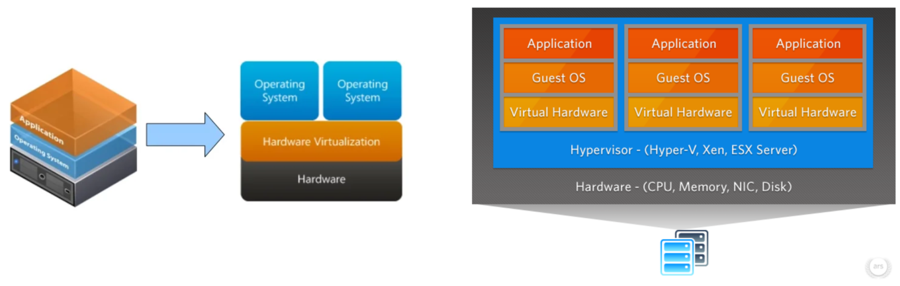
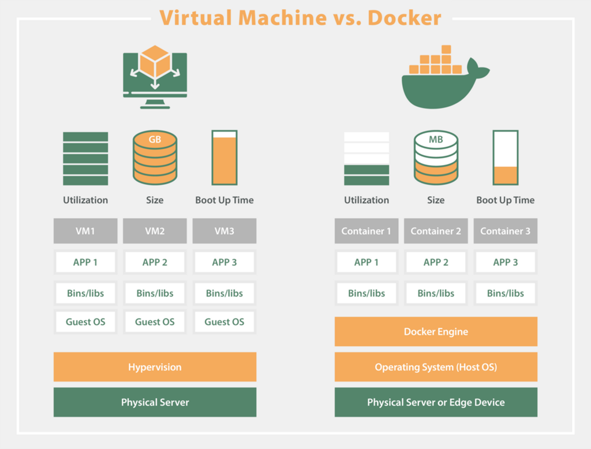
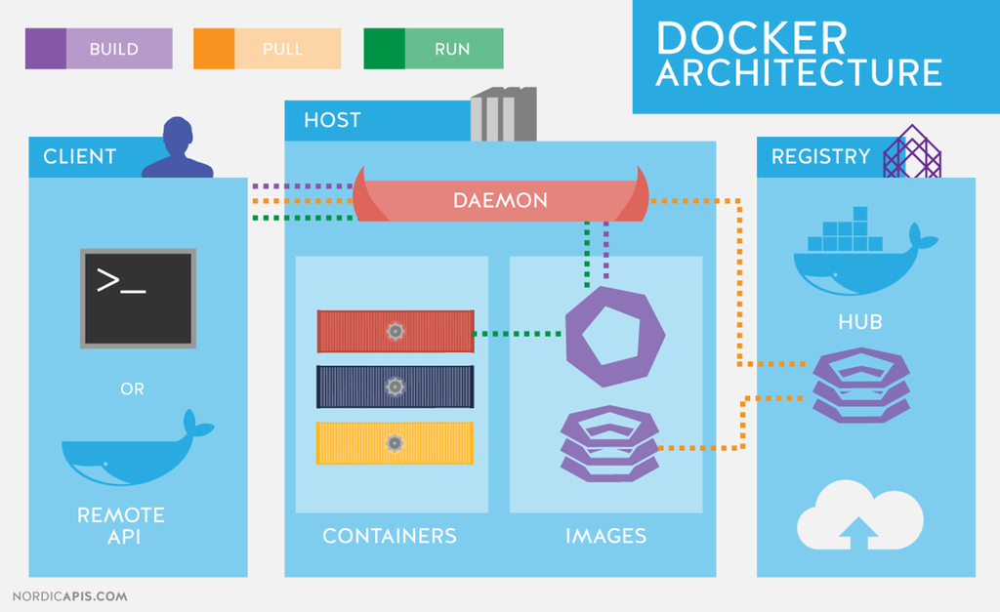
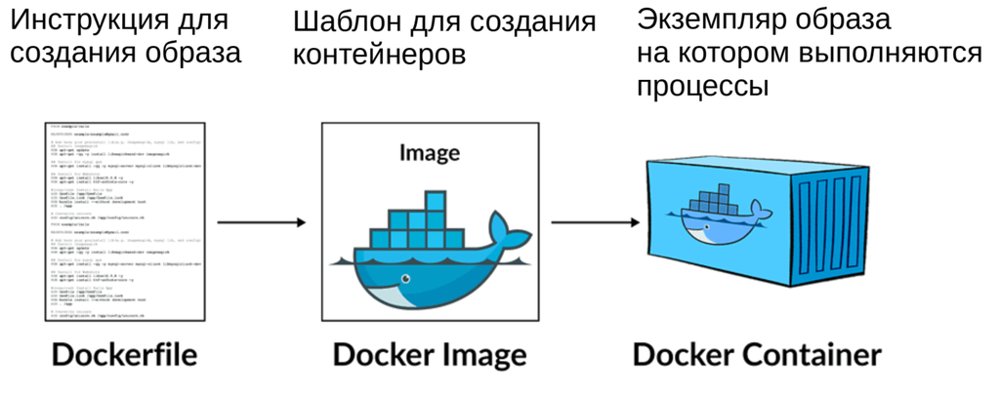
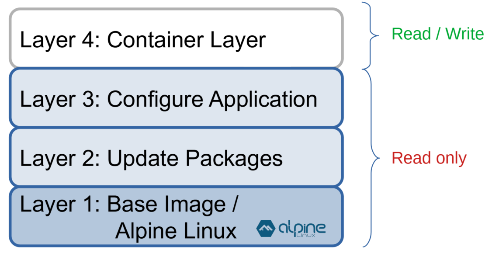
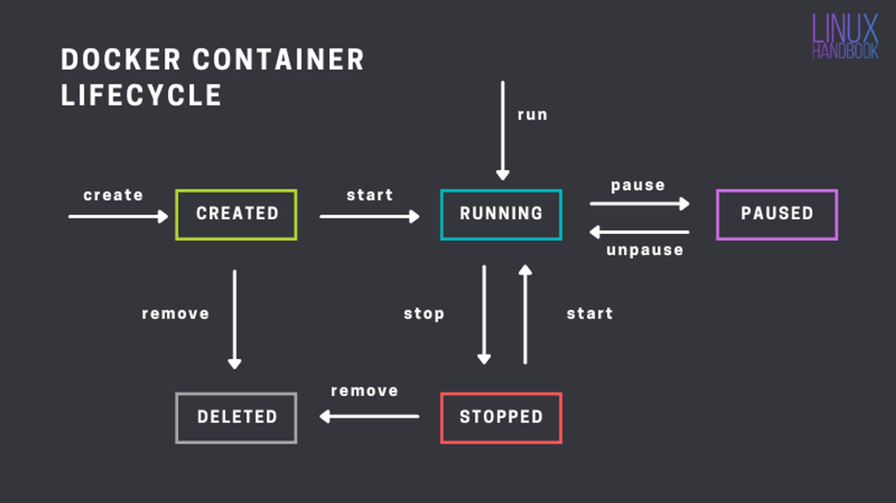
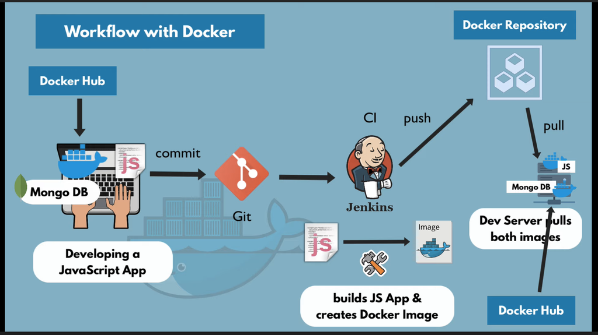
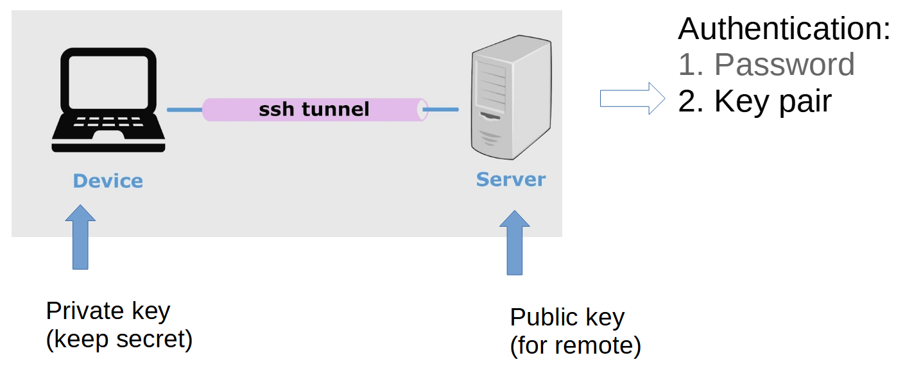
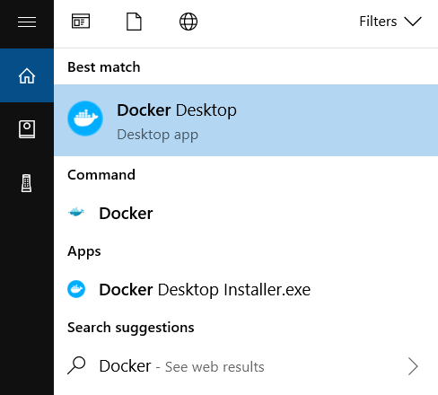
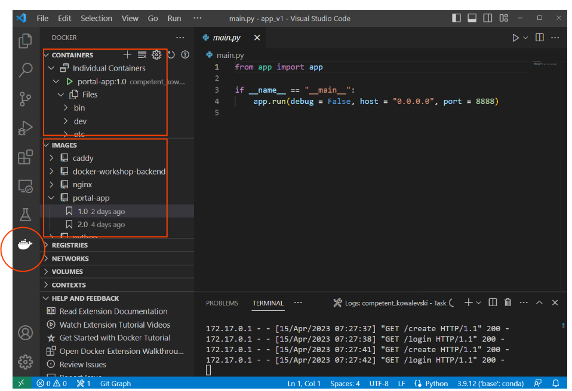

#

## Контейнер для изоляции приложений


- Изолированное окружение (файловая система, процессы, сеть)
- Конфигурационные файлы
- Зависимости
- Стартовый скрипт


## Docker Inc.

2013 — Опубликован код Docker под открытой лицензией Apache 2.0

(Community Edition)

Enterprise Edition — Проприетарная лицензия Docker Inc.

## Виртуализация



- VMware ESXi
- Microsoft Hyper-V
- Linux KVM
- XEN

## Контейнерная изоляция



1. Контейнер меньше «весит»
2. Контейнер быстрее запускается
3. Контейнер требует меньше ресурсов

## Облачные провайдеры


## Архитектура Docker



## Различие между образом (Image) и контейнером



## Слои образа



## Docker Hub

[hub.docker.com](https://hub.docker.com/search?q=)

- Official images
- Versions
- Tags

## Жизненный цикл контейнера



## Workflow



## Подключение в серверу по SSH

```
$ ssh -i .ssh/<mykey> <user>@<server.domain>
```




Создание пары ключей (Git-bash for Windows):

```bash
$ mkdir ~/.ssh

$ ssh-keygen.exe
Generating public/private rsa key pair.
Enter file in which to save the key (/c/Users/Andrey/.ssh/id_rsa): .ssh/mykey
Enter passphrase (empty for no passphrase):
Enter same passphrase again:

# private and public keys
$ ls -a .ssh/
mykey  mykey.pub

# add public key to the server
(server)$ cat >> ~/.ssh/authorized_keys
```

## Установка Docker Desktop

Скачать приложение Docker Desktop для Windows 10/11 или MacOS:

[https://docs.docker.com/desktop/](https://docs.docker.com/desktop/)

### Для WINDOWS:

Установка и обновление WSL2:

[https://learn.microsoft.com/en-us/windows/wsl/install-manual](https://learn.microsoft.com/en-us/windows/wsl/install-manual)

Включение функций виртуализации:

[https://docs.docker.com/desktop/troubleshoot/topics/#virtualization](https://docs.docker.com/desktop/troubleshoot/topics/#virtualization)

Включение виртуализации в BIOS:

[https://bce.berkeley.edu/enabling-virtualization-in-your-pc-bios.html](https://bce.berkeley.edu/enabling-virtualization-in-your-pc-bios.html)



```bash
$ docker -v
```

## Запуск первого контейнера

```bash
$ docker run hello-world
```

## VSCode - Docker extension


