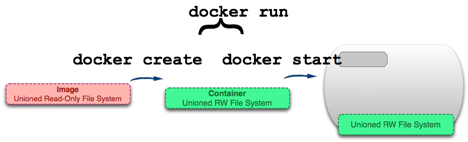
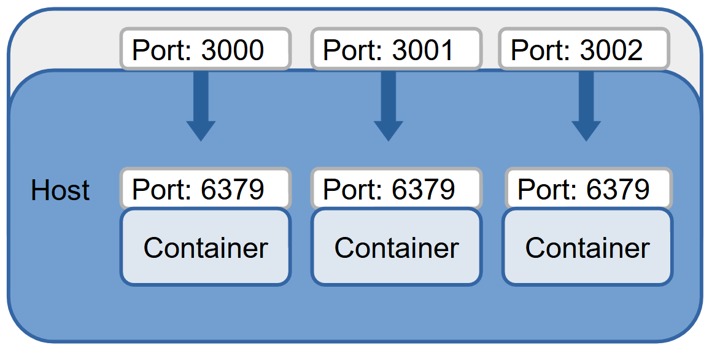
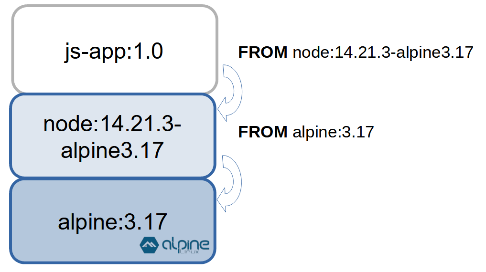

# Docker контейнеры


## Загрузка образа с Docker Hub  запуск контейнера

[https://hub.docker.com/](https://hub.docker.com/)

```bash
docker pull <image>           # pull image from docker hub
docker pull image:version

docker images                 # list local images

docker create --name <name> <image>  # create container <name>
docker start <name>

docker run <image>          # pull, create container and start
docker run -d <image>       # detached mode
docker run -d --rm <image>  # remove after stop

docker ps      # running containers
docker ps -a   # list all containers running and stopped 
```

## Создание и запуск контейнера



## Управление контейнерами

```bash
docker stop <container id>           # or container name
docker start <container id>         

docker logs <container id> | <container name>
docker logs <container id> -f         # log stream
docker top <container id>             # top procesess
```

## Удаление контейнеров и образов

```bash
docker rmi <image id>        # remove image

docker rm <container id>     # remove container
docker rm -f <container id>  # kill and remove

docker container prune       # remove all stopped containers
```

## Практическое задание 1

### 1. Скачайте образ Redis DB

```bash
$ docker pull redis:alpine
$ docker images
```

### 2. Запустите контейнер Redis
```bash 
$ docker run -d --rm --name redis-<nickname> redis:alpine
$ docker ps
```

### 3. Проверьте список процессов

```bash
$ docker top redis-<nickname>
```

### 4. Проверьте лог сообщений

```bash
$ docker logs <container_name>
```

### 5. Остановите контейнер

```bash
$ docker stop redis-<nickname>
```

## Проброс портов (Port mapping)




```bash
docker run -d -p3000:6379 redis:alpine   # host port 3000
docker run -d -p3001:6379 redis:6.2      # host port 3001
```

## Практическое задание 2

### Запустите контейнер с пробросом портов:

```
docker run -d --rm \
-p3001:6379 \
--name redis-<nickname> \
redis:alpine redis-server --save 60 1
```

## Подключение к рабочему контейнеру

```bash
docker run -d --rm \
-p3001:6379 \
--name redis-db \
redis:alpine redis-server --save 60 1

# winpty prefix (git-bash for windows)
docker exec -it <container id> /bin/sh      # interactive terminal
> exit
```

### Консоль Redis DB

```
docker exec -it redis-db redis-cli
> keys *
> get numVisits
> set numVisits 0 
> exit

docker exec -it redis-db sh
> ls /data
```

## Dockerfile

FROM `<image>`

- установить базовый образ

RUN `<command>`

- выполнить команду Linux внутри контейнера
(может быть несколько команд)

COPY `<local> <container_path>`

- копирование с host машины в контейнер

ENV `<NAME>=<value>`

- передать переменную окружения внутрь контейнера

CMD `["<command>", "<parameter>"]`

- запустить приложение
(точка входа, однократно)

## Создание образа



```bash
$ docker build -t js-app-<nickname>:1.0 .
```

Последний параметр в команде - точка ".", означает что `Dockerfile` находится в текущей директории.

## Список слоев образа

```
$ docker history js-app:1.0

$ docker history node

$ docker history alpine
```
