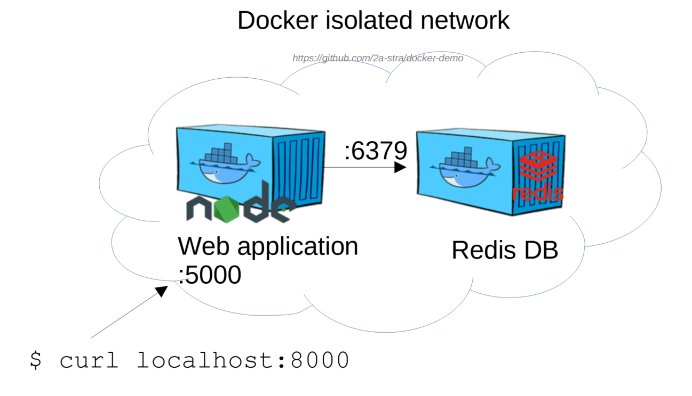
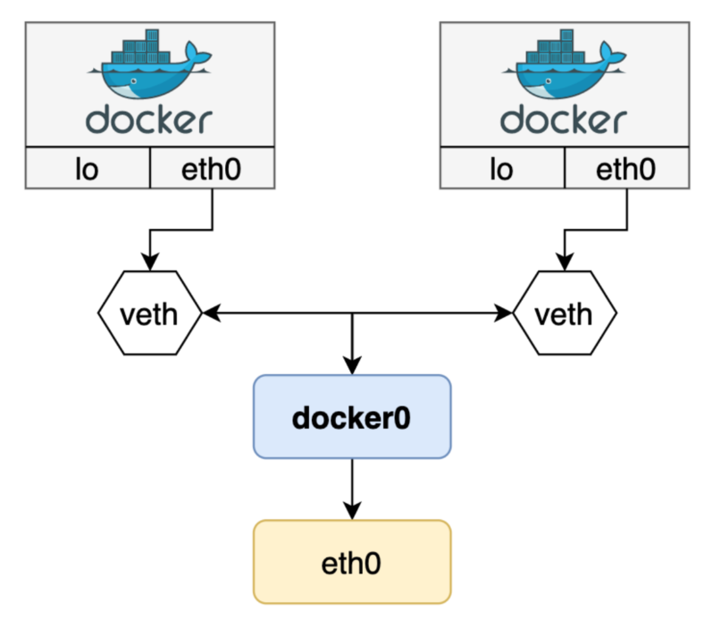

# Docker JS web application



## Сеть Docker network



```bash
docker network ls
docker network create network-<nickname>
```

## Практическое задание

### 0. Отредактируйте имя `host` в файле server.js

```javascript
  host: 'redis-db',
  port: 6379
```

### 1. Создайте новый образ с веб-приложением:

```bash
docker build -t js-app-<nickname>:1.0 .
```

Последний параметр в команде - точка ".", означает что `Dockerfile` находится в текущей директории.

### 2. Запустите контейнер `redis`:

```bash
docker run -d --rm \
--name redis-<> \
--net network-<> \
redis:alpine redis-server --save 60 1
```
### 3. Запустите контейнер `js-app`:

```bash
docker run -d --rm \
-p <8000>:5000 \
--name web-<nickname> \
--net network-<> \
js-app-<nickname>:1.0
```

### 4. Подключитесь через интерактивный терминал к запущенному контейнеру:

```bash
docker exec -it web-<> sh
```

Проверьте содержимое рабочего каталога:
```bash
ls -l
```

### 5. Сделайте запрос к БД через веб-интерфейс:

`http://localhost:8000/`

Или через консоль:

```bash
curl localhost:8000
```

### 6. Проверьте лог сообщений и список запущенных процессов:

```bash
docker logs web
docker top web
```

[Source](https://github.com/docker/awesome-compose/tree/master/nginx-nodejs-redis)