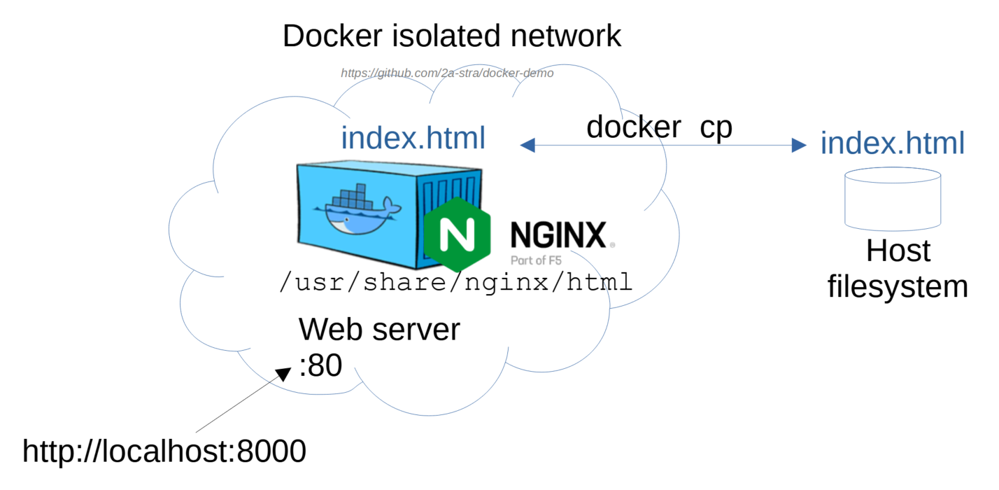

# Docker copy



## Практическое задание

### 1. Запустите контейнер nginx:

```bash
docker run -d --rm -p 8000:80 --name web nginx:alpine
```

### 2. Откройте страницу в браузере:

`http://localhost:8000/`

### 3. Скопируйте index.html из контейнера «web» в локальную папку:

```bash
docker cp web:/usr/share/nginx/html/index.html ./

cat index.html
```

### 4. Замените index.html и скопируйте его обратно в контейнер:

```bash
echo "My test page for Nginx" > index.html

docker cp ./index.html web:/usr/share/nginx/html
```

### 5. ткройте страницу снова в браузере:

`http://localhost:8000/`


# Docker commit

## Список изменений в файловой системе контейнера:

```
docker diff web
```

Symbol | Description
---|---
A | файл добавлен
D | файл или директория была удалена
C | файл или директория изменена

## Сохранить изменения в новом образе:

```bash
docker commit web nginx-index:v1
docker stop web
docker run -d --rm -p 8000:80 --name web2 nginx-index:v1
```