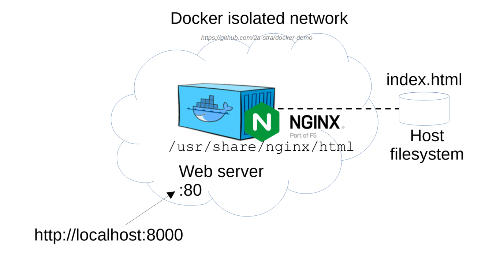
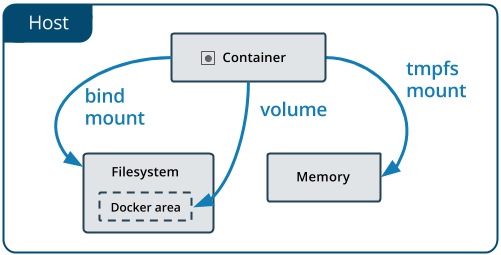

# Docker: host volume for Nginx





## Создайте тестовый файл index.html:

```bash
echo "Docker test page" > index.html
```

### Запустите docker nginx контейнер (Windows powershell):
```bash
docker run -d --rm -p 8000:80 -v ${PWD}\starta\html:/usr/share/nginx/html --name web nginx:alpine
```

Не указывайте двоеточие ":" в пути в Windows.

## Различный синтаксис для текущей директории в разных терминалах:

- Windows CLI: `%cd%`

- Windows Powershell: `${PWD}`

- Windows absolute path with small "c": `/c/Users/`

- Windows git-bash path with small "c": `//c/Users/`

- MacOS: `/Users/`


### Запустите docker nginx контейнер (Linux host):

```bash
docker run -d --rm \
-p 8080:80 \
-v ~/.data:/usr/share/nginx/html \
--name web-nginx \
nginx:alpine
```

## Практическое задание:

1. Создайте index.html в локальной папке.

2. Запустите контейнер nginx и подключите host volume:

```bash
docker run -d --rm -p 8000:80 -v <host_path>:/usr/share/nginx/html --name web nginx:alpine
```

3. Откройте страницу в браузере: `http://localhost:8000/`

4. Измените страницу html на локальном диске.

```bash
echo "Hello World 2023" >> index.html
```

5. Обновите страницу в браузере.

6. Запустите ещё один контейнер Nginx с тем же volume:

```bash
docker run -d --rm -p 8001:80 -v <host_path>:/usr/share/nginx/html --name web2 nginx:alpine
```

7. Повторите пп. 4-5.


