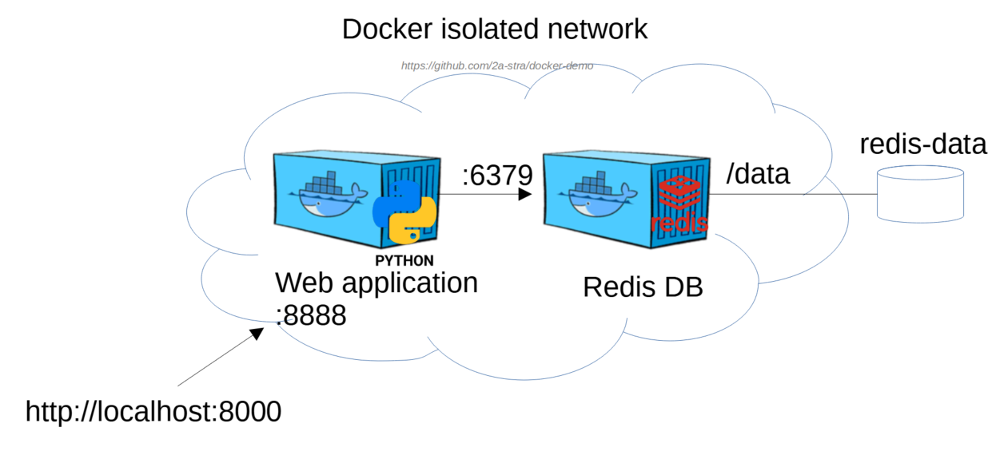
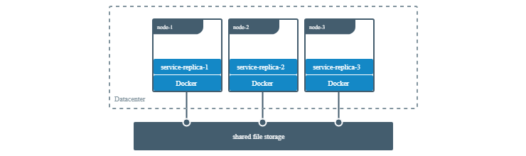
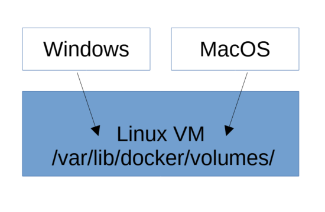

# Docker: named volume for Redis




## Практическое задание

### 1. Создайте новый volume с именем `redis-data`:

```bash
docker volume create redis-datadocker

volume ls
docker volume inspect redis-data
```

### 2. Запустите контейнер `redis-db` с подключенным volume `redis-data`:

```bash
docker run -d --rm \
-v redis-data:/data:rw \
--name redis-db \
--net redis-network \
redis:alpine redis-server --save 60 1
```

### 3. Запустите контейнер с web-приложением и запишите новые данные в БД через веб-интерфейс: 

`http://localhost:8000`

[portal-app](https://github.com/2a-stra/docker-demo/tree/main/lab2)

### 4. Остановите контейнер `redis-db` и удалите его:

```
docker stop redis-db
(docker rm redis-db)
```

### 5. Создайте и запустите новый контейнер redis-db c тем же volume.

### 6. Проверьте, что данные в базе данных сохранились с прошлого запуска:

`http://localhost:8000`


## Общее файловое хранилище:



## Путь к файлам volume в Windows и MacOS 



```
# Windows WSL2:
\\wsl$\docker-desktop-data\data\docker\volumes

# MacOS:
screen ~/Library/Containers/com.docker.docker/Data/vms/0/tty
cd /var/lib/docker
```