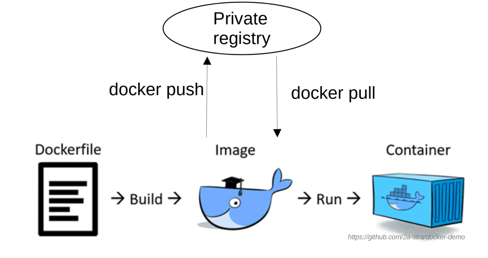

# Docker private registry



Контейнер с приложением `registry` на Docker Hub:

```
https://registry.hub.docker.com/_/registry
```

## Практическое задание

### 1. Запуск `registry:2` на локальном хосте на порту 5000:

``` bash
docker run -d -p 5000:5000 --restart always --name registry registry:2
```

### 2. Добавляем имя приватного репозитория `localhost` к нашему образу:

```bash 
docker tag portal-app:1.0 localhost:5000/portal-app:1.0
```

### 3. Загружаем образ в наш репозиторий:

```bash
docker push localhost:5000/portal-app:1.0
```

### 4. Удаляем образ с хоста:

```bash
docker rmi portal-app:1.0
docker images
```

### 5. Запускаем контейнер используя образ из нашего приватного репозитория

a) Командой docker run:

```bash
docker run \
-p 8001:8888 \
-e REDIS_HOST=redis-db \
-e REDIS_PORT=6379 \
-e APP_PORT=8888 \
--name portal-local \
--name redis-network \
localhost:5000/portal-app:1.0
```

Source (lab2): [portal-app:1.0](https://github.com/2a-stra/docker-demo/tree/main/lab2)

b) С помощью docker-compose:

```yaml
services:

  portal-app:      # container name
    image: localhost:5000/portal-app:1.0
```

Source (lab3): [portal-app](https://github.com/2a-stra/docker-demo/tree/main/lab3)
