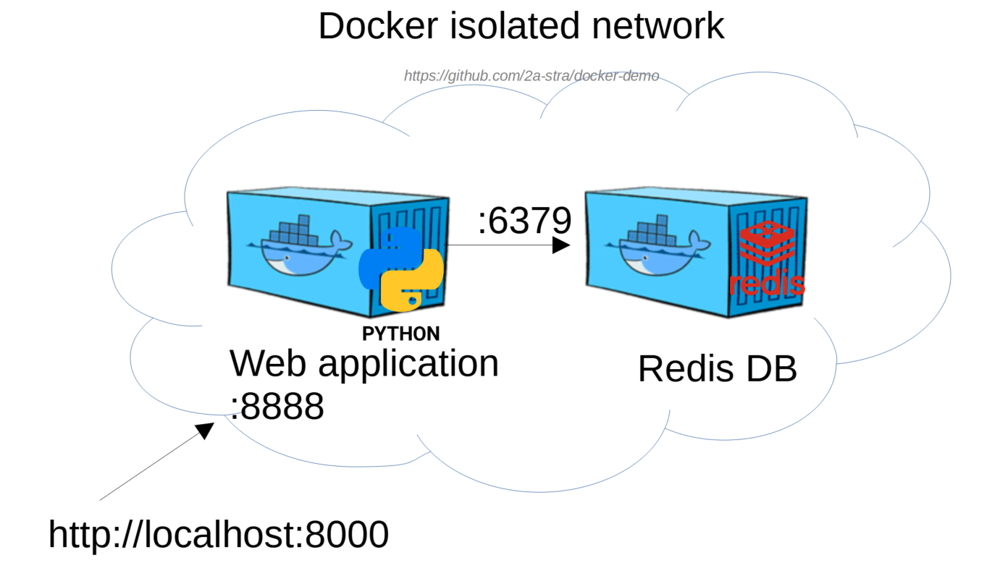
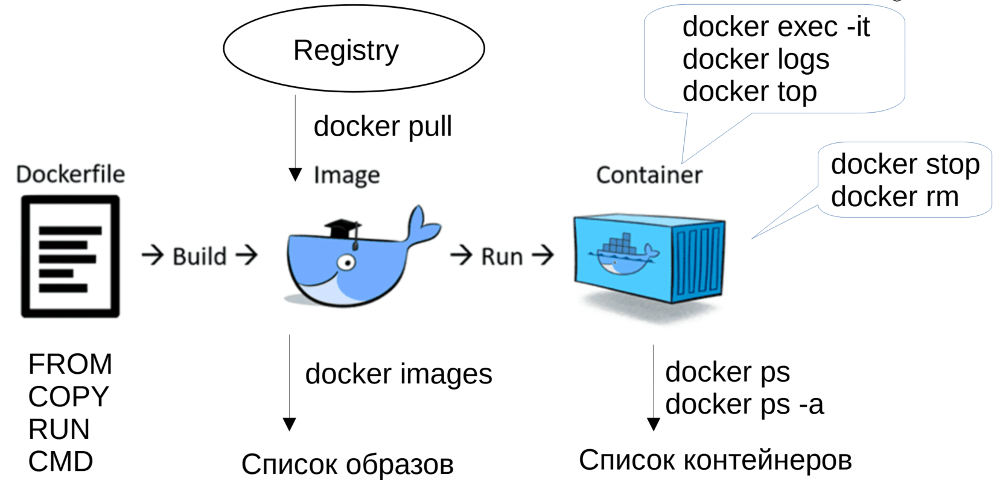

# Port mapping (lab2)



## Команды Docker



## Практическое задание 1

### 1. Создайте новый образ с веб-приложением:

```bash
docker build -t portal-app:1.0 .
```

### 2. Запустите контейнер с Redis DB:

```bash
docker run -d --rm \
--name redis-db \
redis:alpine \
redis-server --save 60 1
```

### 3.  Запустите контейнер с веб-приложением `portal-app:1.0`:

Свяжите порт 8000 на хосте с портом 8888 в контейнере. Через переменные окружения передайте данные об IP-адресе БД и используемых портах.

```bash
docker run -d --rm \
-p 8000:8888 \
-e REDIS_HOST=172.17.0.3 \
-e REDIS_PORT=6379 \
-e APP_PORT=8888 \
--name portal-app \
portal-app:1.0
```

Укажите IP-адрес контейнера `redis-db` в переменной REDIS_HOST:

```bash
docker inspect redis-db | grep IPAddress
```

### 4. Проверьте работу приложения с базой данных через web-интерфейс:

`http://localhost:8000`

Или в консоли:

```bash
# Get users list
curl localhost:8000/list

# Create new user
curl -X POST -d 'user=Alice&password=123' http://localhost:8000/create

# Delete user
curl -X POST -d 'user=Alice' http://localhost:8000/delete
```

### 5. Запустите интерактивный терминал контейнера `portal-app` и проверьте переменные окружения env:

```bash
docker exec -it portal-app env
```

### 6. Запустите стрим лога веб-приложения:

```bash
docker logs portal-app -f
```

## Docker network


```bash
docker network ls

docker network create <network_name>

docker run -d \
--name redis-db \
--net <network_name>
redis:alpine
```

## Практическое задание 2

### 1. Создайте новую сеть `redis-network`:

```bash
docker network create redis-network
docker network ls
```

### 2. Запустите контейнер `redis-db` с подключением к сети `redis-network`:

```bash
docker run -d \
--name redis-db \
--net redis-network
redis:alpine
```

### 3. Запустите контейнер `portal-app` с подключением к сети `redis-network`:

```bash
docker run -d --rm \
-p 8000:8888 \
-e REDIS_HOST=redis-db \
-e REDIS_PORT=6379 \
-e APP_PORT=8888 \
--name portal-app \
--net redis-network \
portal-app:1.0
```

### 4. Протестируйте работу веб-приложения с БД:

`http://localhost:8000`


