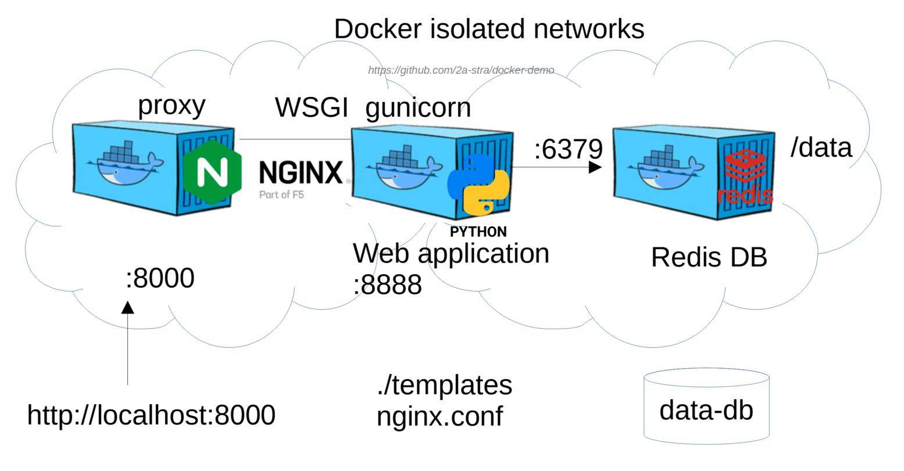

# Docker compose (lab3)



Файл в формате YAML `portal.yaml` описывает запускаемые сервисы (контейнеры).

В файле yaml имеют значения одинаковые отступы для параметров одного уровня.

## Redis DB
```yaml
version: '3'
services:
  redis-db:        # container name
    image: redis:alpine
    volumes:
      - data-db:/data:rw

volumes:
  data-db:
    driver: local
```

## Web-app (backend) and web-server (proxy):
```
  portal-app:      # container name
    build: web     # build from Dockerfile in the "web" folder
    environment:
      - APP_PORT=8888
      - REDIS_HOST=redis-db
    volumes:
      - ./templates:/app/templates:ro
    depends_on:
      - redis-db

  nginx:           # container name
    image: nginx:alpine
    ports: 
      - 8000:8000
    volumes:
      - ./nginx.conf:/etc/nginx/nginx.conf:ro
    depends_on:
      - portal-app
```


### 1. Клонируйте проект:

```bash
git clone https://github.com/2a-stra/docker-demo.git
cd docker-demo
```

### 2. Измените имя папки `lab3` на папку с новым названием проекта `project-<name>`:

```bash
mv lab3 project-<name>
cd project-<name>
```

Это имя будет использоваться в именах сервисов.

### 3. Измените в файле `portal.yaml`:
- Nginx host port 8000


## Практическое задание 2

### 1. Запустите контейнеры с помощью `docker-compose`:

```bash
docker-compose -f portal.yaml up -d
```

### 2. Проверьте запущенные контейнеры:

```bash
docker ps
```

### 3. Проверьте список `volume` и `network`:

```bash
docker volume ls
docker network ls
```

### 4. Проверьте работу web-приложения через веб-интерфейс: http://localhost:8000


### 4.1 Проверка работы веб-приложения в терминале:

```bash
# Get users list
curl localhost:8000/list

# Create new user
curl -X POST -d 'user=Alice&password=123' http://localhost:8000/create

# Delete user
curl -X POST -d 'user=Alice' http://localhost:8000/delete
```

### 5. Остановите `docker-compose`:

```bash
docker-compose -f portal.yaml down
```

### 6. Проверьте список всех контейнеров:

```bash
docker ps -a
```

## Практическое задание 3

### 1. Запустите приватный репозиторий (lab3.3).

```bash
docker run -d -p 5000:5000 --restart always --name registry registry:2
```

### 2. Добавляем имя приватного репозитория `localhost` к нашему образу:

```bash
docker tag <project-name>-portal-app localhost:5000/portal-app-<name>:2.0
```

### 3. Загружаем образ в наш репозиторий:

```bash
docker push localhost:5000/portal-app:2.0
```

Список образов в приватном репозитории:

```bash
curl -X GET http://localhost:5000/v2/_catalog
curl -X GET http://localhost:5000/v2/portal-app/tags/list
```


### 4. Удаляем образы с хоста:

```bash
docker rmi <project-name>-portal-app
docker rmi localhost:5000/portal-app:2.0
docker images
```

### 5. Запускаем контейнер используя образ из нашего приватного репозитория:

Копируем `yaml` файл:

```bash
cp portal.yaml compose.yaml
```

Редактируем `compose.yaml` для использования контейнера из нашего репозитория:

```yaml
services:

  portal-app:      # container name
    image: localhost:5000/portal-app:2.0
```

Запускаем docker-compose:

```bash
docker-compose up -d
```

Проверяем список запущенных контейнеров и останавливаем их:

```bash
docker-compose ps
docker-compose down
```
